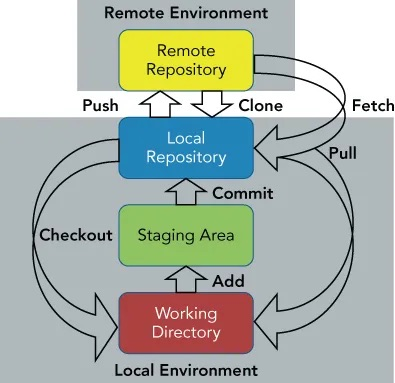

# Lecture 02: Setting up GitHub and creating first repositories

## What is GitHub?

GitHub is a web-based platform that allows you to store and manage your code. It is widely used by developers and data scientists to collaborate on projects and share their work with others. In this course, we will be using GitHub to store and share our code, both for the exercises as well as the final assignment. Below, you can see how a local environment (laptop) interacts with the remote environment (GitHub browser) by first downloading (`clone`) a code-based project (`repository`) and then updating the remote version with changes done locally on your computer (arrows going up) or updating the local version with changes being done by colleagues (arrows going down).



*Figure: Scheme explaining the Git Workflow taken from [this blogpost](https://medium.com/@itsmepankaj/git-workflow-add-commit-push-pull-69adf44cf812), which has more detailed information on it.*

This Git workflow ensures that changes are tracked, saved, and shared in a structured way, preventing data loss and enabling collaboration. Staging (`add`) selects changes, committing (`commit`) saves them with a message, and pushing (`push`) syncs them with a remote repository for others to access.

Now, you will create your first repository, a profile README that will appear on your user page. 

### What is the difference between Git and GitHub?

Git is a distributed version control system that allows developers to track changes, manage branches, and collaborate on code efficiently, while GitHub is a cloud-based platform that provides hosting for Git repositories along with additional collaboration features like issue tracking, pull requests, and web-based interfaces to facilitate teamwork and open-source contributions.

In this course, we will use `Git` commands for version control, but will be using GitHub as the remote storage for our repositories.

## 1. Create a Profile README

A profile README is a special repository that is automatically displayed on your GitHub profile. It is a great way to introduce yourself and showcase your work. Take your time to create such a README on the GitHub website.

<details>
<summary>Detailed steps</summary>

1. On GitHub, in the upper-right corner of any page, click on the `+` and then click `New repository`.
2. Name the repository with your GitHub username (must match exactly!).
3. Select the `Public` option.
4. Check the box to `Initialize this repository with a README`.
5. Click `Create repository`.
6. Above the right sidebar, click on `Edit README` and start editing the file.
7. You can use the [GitHub Flavored Markdown](https://guides.github.com/features/mastering-markdown/) to format your README.
8. Once you are done, click on `Commit changes`.

</details>

You can take some inspiration from your TAs ([@jwa7](https://github.com/jwa7), [@sarina-kopf](https://github.com/Sarina-kopf) or [@rneeser](https://github.com/rneeser)) or get some tips for creative profiles from [this blogpost](https://dev.to/kshyun28/how-to-make-your-awesome-github-profile-hog).

## 2. GitHub Basics: Create a new repository

Finally, we will create our first repository and update it via the command line. Please make sure to create a public repository (so the TAs can see it) and to add a README file.

### Creating a new repository

1. Go to the GitHub website and click on the `+` in the top right corner and then `New repository`.
2. Name the repository `ppchem` and select the `Public` option. Also check the box to `Initialize this repository with a README`.

### Set up SSH Authentication (One-time setup)

Git needs a secure way to prove your identity to GitHub. We will use an **SSH Key**, which creates a secure link between your computer and GitHub so you don't have to type passwords.

1. Open your terminal (Mac) or Git Bash (Windows).
2. Generate the key by running this command (**replace the email** with your GitHub email):
  ```bash
   ssh-keygen -t ed25519 -C "your_email@example.com"
  ```
3. Press Enter 3 times to accept the default settings and leave the password empty.
4. Display your new public key by running:
  ```bash
  cat ~/.ssh/id_ed25519.pub
  ```
5. Copy the entire output that appears (starts with ssh-ed25519).
6. Go to GitHub > Settings (under your profile icon) > SSH and GPG keys > New SSH key.
7. Paste your key into the box, name it, and click Add SSH key.

### Cloning the repository

1. Open your terminal and **navigate (`cd`) to the directory where you want to store the repository** (replace `~/git` with that folder). This is often a folder called `git` in your home directory (`~`). You have to create the folder with e.g. `mkdir git` if it does not exist yet.
  ```bash
   cd ~/git
  ```
2. Type the following command to clone (download) the repository to your local machine (don't forget to replace `username` with your username):
  ```bash
   git clone git@github.com:username/ppchem.git
  ```
  ⚠️ Important: Ensure you use the SSH URL (starts with git@github.com:) found under the SSH tab in the green Code button on GitHub. If you use HTTPS, it will still ask for a password!

  > **First-time SSH connection:** When cloning for the first time, you may see the following message:
  > ```
  > The authenticity of host 'github.com (IP_ADDRESS)' can't be established.
  > Are you sure you want to continue connecting (yes/no/[fingerprint])?
  > ```
  > This is normal. Type `yes` and press Enter to add GitHub to your list of known hosts. You will only see this message once.


3. Navigate into the repository by typing `cd ppchem`.

In order to clone any repository, you need to have the URL of the repository. You can find the URL by clicking on the green `Code` button on the repository's page.

### Making changes and committing them

Whenever you make changes to your repository, you need to commit them to save the changes to the repository's history. We will add an image to the repository and practice the git workflow.

1. Download an image of your favorite molecule from the internet. Your TAs recommend `Caffeine` :coffee:.
2. Add this image to your `repository` (the project folder). You can do this in one of these ways:
  - drag and drop the image on your file system (this can be done in a VSCode project with the relevant directories open)
  - use the `mv` command shown in the [command table](#summary-of-important-general-commands). The `source` is the downloaded image and `destination` is your repository
3. Check if the file is in the directory by typing `ls`
4. Type the following command to stage the changes and **replace `<caffeine.png>` with your filename**:
  ```bash
      git add <caffeine.png> # stages only the added file - replace with the actual file name
  ```
5. Check if the changes have been staged by typing `git status`.
6. Type the following command to commit the changes:
  ```bash
      git commit -m "Some message" # Replace with a meaningful message
  ```
7. Use `git status` again to see if the changes are now committed.

### Pushing the changes to GitHub

For now, we only made changes to the local repository and committed them (prepared them for upload). We need to push the changes to GitHub to make them available to others.

1. Type the following command to push the changes to GitHub:
  ```bash
      git push origin main # Replace with the branch name if you are not on the main branch
  ```
2. Check in the browser (you might have to refresh the website) if your changes have been updated online.

You can check the status of your repository at any time by typing `git status` in your terminal in the folder of the repository. This will also show you the changes you made and the files you staged as well as the branch you are currently on.

### Working with branches

1. Type the following command to create a new branch and switch to it:
  ```bash
      git checkout -b new-branch-name
  ```
2. Publish the branch to GitHub by typing:
  ```bash
      git push -u origin new-branch-name
  ```

Changing branches locally will change the version that you have access to locally. So if you have a specific file only in the new branch you cannot find it in `main` and therefore also not push changes from there. If you simply want to switch branch, type:

```bash
    git checkout branch-name
```

### Pulling changes from GitHub

If you are working on a repository with others, you might want to pull the changes they made to your local repository. You can do this by typing `git pull` in your terminal in the folder of the repository.

If working collaboratively on a project, where each project member is working on local copies of the same remote repository, and especially if working on the same file, extra care need to be taken when pushing and pulling changes to the remote repository.

In these cases, best practice is often to work in a branch of the repo that is yours alone, and merge changes with other periodically. This will be covered later in the course.

## Summary of important commands


| Command                                                | Description                                                     |
| ------------------------------------------------------ | --------------------------------------------------------------- |
| `git config --global user.name "name"`                 | Set your name in git configuration (only once)                  |
| `git config --global user.email "email"`               | Set your email in git configuration (only once)                 |
| `git clone git@github.com:username/repository.git` | Clone a GitHub repository to your local machine                 |
| `git branch branch-name`                               | Create a new branch                                             |
| `git checkout branch-name`                             | Switch to another branch                                        |
| `git add .`                                            | Track all changes in directory                                  |
| `git commit -m "commit message"`                       | Commit your tracked changes                                     |
| `git push origin branch-name`                          | Push your local commits to the GitHub                           |
| `git pull origin branch-name`                          | Fetch the newest updates from the remote branch                 |
| `git status`                                           | Check the status of your local repository                       |
| `git diff`                                             | Show changes between your working directory and the last commit |
| `git diff --staged`                                    | Show changes between your staging area and the last commit      |


Above are the basic Git commands you'll frequently use which cover most of the general use cases from cloning repositories to making changes and updating your remote branches. Each command is a powerful tool in Git, and they are designed to work together to create a seamless workflow.

Remember, the best way to become comfortable with Git is practice. Try using these commands to manage a test project and experiment until you're confident with the functionality of each one.

## 3. What can I do next?

If you have completed all steps above and still feel like exploring more, here are two suggestions:

- **Beautify your GitHub profile**: Revisit the inspiration links above, especially the [blogpost with tips for creative profiles](https://dev.to/kshyun28/how-to-make-your-awesome-github-profile-hog), and experiment with sections, badges, images, or emojis to make your profile README more personal and informative.
- **Play an advanced Git game**: Try the interactive game at [learngitbranching.js.org](https://learngitbranching.js.org) to practice Git branching, merging, and more advanced workflows in a visual and playful way.