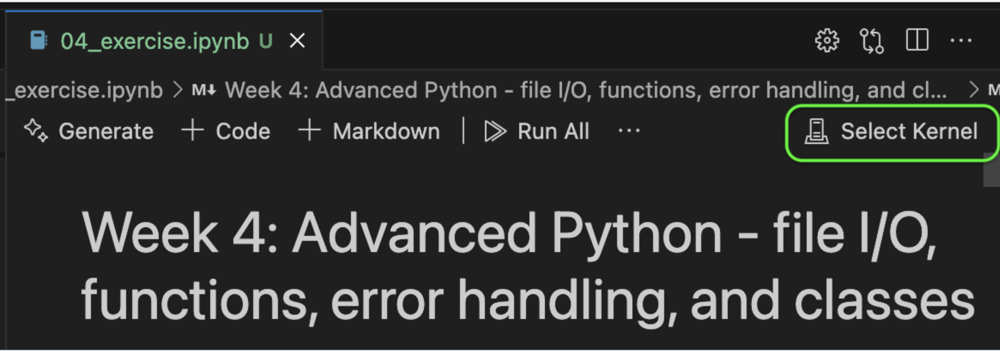
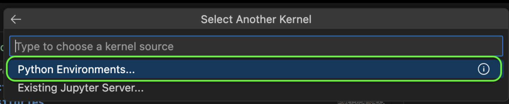
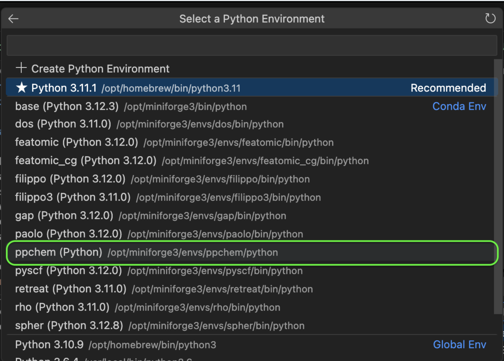
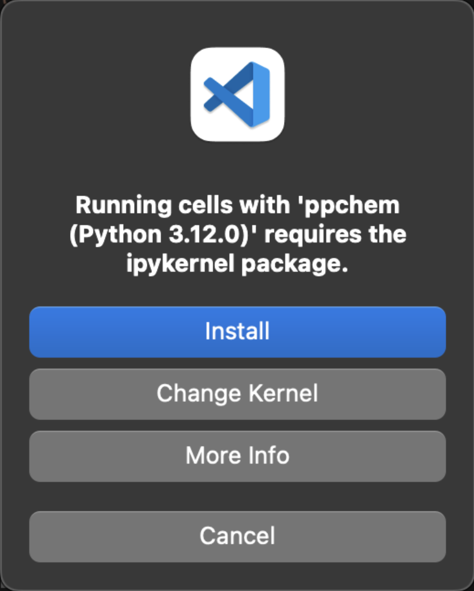

# Lecture 03: Conda and Jupyter notebooks

## Conda

### 1. Create a new environment

Having set up `conda`, we will now create a new environment for this course. We will use this environment to install the necessary packages for the exercises and the final assignment. Please make a new environment with the following properties:

- Name: `ppchem`
- Python version: `3.10`
- Packages:
    - `pandas`
    - `rdkit` (version `2022.09.5`)
    - `jupyter`

You can find all necessary information on what commands to use in the [conda documentation](https://docs.conda.io/projects/conda/en/latest/user-guide/tasks/manage-environments.html).

<details>
<summary>Solution: Commands</summary>
In a terminal, type the following commands:

```bash
conda create -n ppchem python=3.10
conda activate ppchem
pip install pandas  # installs numpy as dependency
pip install rdkit==2022.09.5
pip install jupyter
```

</details>

### 2. Export the environment to a file

Once you have installed all necessary packages, you should export the environment to a file. This file can be used by others to recreate the same environment on their computer. Please use the following command to export the environment to a file called `env.yml`. Save the environment file in the repository you created in the GitHub section and push it to GitHub.

<details>
<summary>Solution: Commands</summary>

Don't forget to repalce `path/to/ppchem` with your path!

```bash
cd <path/to/ppchem>
git checkout main # Make sure to be on the main branch
conda activate ppchem
conda env export > env.yml
git add env.yml
git commit -m "Add environment file"
git push origin main
```

</details>

### Some useful commands

| Command | Description |
|---------|-------------|
| `conda env list` | List all environments on your computer with their respective paths.|
| `conda activate env-name` | activate an environment. |
| `conda list` | List all packages installed in the activated environment. |
| `conda env remove -n env-name` | Remove an environment from your computer. |

## Jupyter notebooks in VS Code

A Jupyter notebook is a Python interface useful for testing and debuging small segments of code. Instead of running at at once, it enables you to set break points and run individual lines of code one at at time,
First install the Jupyter extension in VSCode


Open your python-course folder on VSCode and open a terminal in this directory.


Clone the code using the following command:
```bash
git clone https://github.com/schwallergroup/practical-programming-in-chemistry-exercises.git
```

Then double click on the Lecture 3 exercise notebook to open it. Selected a kernel by clicking
Select Kernel -> Python Environments -> ppchem





Then install IPython if prompted. 

# Python Basics Tutorial Notebook

This notebook provides an introduction to fundamental Python programming concepts, focusing on data types, control structures, and file path handling.
Work through the exercises notebook and check your answers against the solutions notebook at the end of the class.

## Contents

1. **Python Data Types**
   - Numeric types (int, float, complex)
   - Sequence types (str, list, tuple)
   - Mapping types (dict)
   - Sets and Boolean types
   - Comprehensive examples and exercises
   - List operations and methods

2. **Control Structures - Loops**
   - While loops with practical examples
   - For loops and iteration
   - Loop control (break, continue)
   - Index-based iteration
   - List modification exercises

3. **Path Handling**
   - Introduction to pathlib
   - Cross-platform path management
   - Directory and file operations
   - Path manipulation exercises

## Exercises

The notebook includes practical exercises covering:
- List manipulation and slicing
- Boolean logic and conditional statements
- Loop implementation and control flow
- File system operations
- Type conversion and data handling

Each section contains both guided examples and challenge exercises with real-world applications in scientific contexts.

## Usage

Work through the notebook sequentially, as concepts build upon each other. Complete all exercises to reinforce learning. Code examples can be run independently to experiment with different scenarios.

## Notes

- The notebook uses chemistry-related examples to demonstrate programming concepts
- Pay special attention to the path handling section for cross-platform compatibility
- Some exercises are designed to identify and fix common programming mistakes
