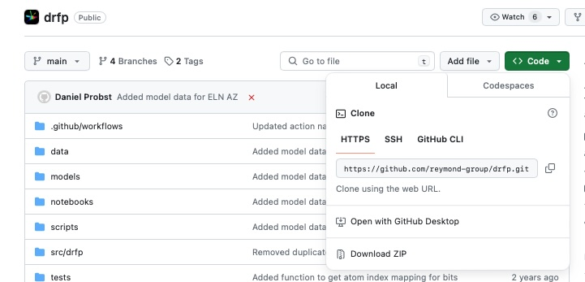

# Lecture 8: Python Packaging

## Setup

As always, we first need to update our code. This can be done by following these steps:

1. Open VSCode and open the folder where you cloned the `practical-programming-in-chemistry-exercises` repository.
2. Go to the Source Control tab (the one that looks like a branch) and click on the three dots.
3. Click on `Pull, Push`.
4. Click on `Pull` to update your local repository.
5. Copy the exercise notebook to your folder/repository to work on it.

If you cannot pull because you have made changes, copy the changed files into your own repository, revert the changes (arrow pointing left), and then pull.

Aaaand that's it! You're ready to start with this lecture's exercises! **Happy coding** :star_struck:

# Part 1: Python Package installation

In this tutorial, we will explore different ways to install a Python package. We will specifically focus on installing the `drfp` (Direct Retrosynthesis-based Fingerprint) package, which was discussed in the lecture. Before we proceed, let's set up a **new** conda environment with Python 3.11 to ensure compatibility and isolation.

We will briefly discuss two methods of installing a python package: a) via `pip` and b) from source. To do this we will setup new and separate environments for each.

## a) Installing from PyPI

Open your terminal and create a new conda environment named `drfp_pypi` with Python 3.10, then activate it:

```
conda create -n drfp_pypi python=3.10
conda activate drfp_pypi
```

Now you can install the `drfp` package from PyPI. You will also need to downgrade `numpy` to avoid an error coming from version conflicts.
```
pip install drfp
pip install numpy==1.25  # to avoid version conflicts with rdkit
```
Open the notebook `Part1/08_drfp_partA.ipynb` and select the kernel for the environment `drfp_pypi`. You will have to install `iPython` again, just as you did in the exercises for Lecture 3. See that [README](../Lecture03/README.md) for help.

Now run the cell in the notebook. This is just a quick test to make sure that `drfp` was properly installed.

## b) Installing from Source

In the second part, you can install the `drfp` package directly from the source code hosted on GitHub. This method is useful if you want to work with the latest development version or contribute to the project.

It's a good practice to create a separate conda environment when installing from source to keep things organized and avoid conflicts with other environments. 

In your terminal, deactivate your current environment with `conda deactivate`, then follow the steps above to **create a new environment**, this time called `drfp_source` and activate it.

Next, we will clone the source code and install the package from source:

1. Clone the GitHub repository by running the address you find on [https://github.com/reymond-group/drfp/](https://github.com/reymond-group/drfp/) under `Code`. One potential folder to place it would be `~/git`, but you can also put it into another folder. The folder has to be created before you can navigate there with `cd`. It should be outside your exercises folder.



Navigate on your terminal to the folder where you keep your git repositories, for example `~/git`. In here, **make sure you are not inside another repository**. You can do this by using `git status`, which should return an error `fatal: not a git repository` if you are **not** inside another repository. 

Clone the `drfp` package and navaigate to it:

```
git clone https://github.com/reymond-group/drfp.git
cd drfp
```

Install the package using pip in development (or "editable") mode:
```
pip install -e .
```

The `-e` flag stands for "editable" mode, which allows you to make changes to the source code and have them immediately reflected in your installation without having to reinstall the package. This is not necessary in this case, but typically useful if you want to make changes to the code. You could have also run `pip install .`. 

By installing from source in development mode, you have the flexibility to modify the code or stay up-to-date with the latest changes made to the package that haven't been released on PyPI. Care should be taken though, as releases on PyPI are typically more stable and robust than the latest version on GitHub.

Remember, it's generally a good practice to create a new conda environment for each project to avoid potential conflicts and maintain a clean working environment.

Now you can open and execute the code cells in `Part1/08_drfp_partB.ipynb`. 


# Part 2: Turn a scripts into Python packages


As we're simulating the process of building a new project, let's create another conda environment and activate it:
```
conda deactivate
conda create -n reactions python=3.10
conda activate reactions
```
and install some necessary packages:
```
pip install rdkit
pip install numpy==1.25  # to avoid version conflicts with rdkit
```

Next follow the instructions in `Part2/08_from_script_to_package.ipynb` to learn more about how to build your first package using `pyproject.toml`. Remember that the build tool will only recognize subfolders containing an `__init__.py` file (even if empty) as part of the package. 

Additional information can be found on how to write a `pyproject.toml` file can be found on [https://packaging.python.org/en/latest/guides/writing-pyproject-toml/](https://packaging.python.org/en/latest/guides/writing-pyproject-toml/). Here, we will first just explore the minimal set of metadata. 
